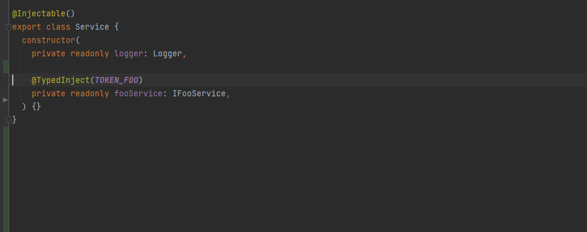

# typesafe-decorators

<p>
  <a href="https://github.com/sorgloomer/ts-typesafe-decorators/actions?query=branch%3Amaster"></a>
  <a href="https://opensource.org/licenses/MIT" rel="nofollow"></a>
</p>

<div>
  <a href="https://github.com/sorgloomer/ts-typesafe-decorators">GitHub</a>
  <span>&nbsp;&nbsp;•&nbsp;&nbsp;</span>
  <a href="https://www.npmjs.com/package/typesafe-decorators">npm</a>
  <span>&nbsp;&nbsp;•&nbsp;&nbsp;</span>
  <a href="https://github.com/sorgloomer/ts-typesafe-decorators/issues/new">Issues</a>
  <span>&nbsp;&nbsp;•&nbsp;&nbsp;</span>
  <a href="https://twitter.com/hege_hegedus">@hege_hegedus</a>
  <br />
</div>

# Intro

Typescript 5 made it possible for legacy experimental decorators to check the types of the things they are applied to.   

This repository contains helper libraries to enforce the correct types of injected services at compile time, for your
favorite ioc container.

[](./docs/demo.webm)


### Usage with NestJS

Install

```shell
npm i --save nestjs-typesafe-decorators
```

Use the `TypedInjectionToken<IService>` type to annotate your injection tokens

```typescript
export const TOKEN_FOO: TypedInjectionToken<IFooService> = 'TOKEN_FOO';
```

Replace `@Inject(...)` decorators with `@TypedInject(...)`

```typescript
@Injectable()
export class Service {
  constructor(
    @TypedInject(TOKEN_FOO)
    private readonly fooService: IFooService,
  ) {}
}
```

Wrap your token based providers in `typedProvider(...)`

```typescript
@Module({
  providers: [
    Service,
    typedProvider({ provide: TOKEN_FOO, useClass: FooService }),
  ]
})
class AppModule {}
```


### Usage with Inversify

Install

```shell
npm i --save inversify-typesafe-decorators
```

Use the builtin `ServiceIdentifier<T>` type to annotate your injection tokens

```typescript
import { interfaces } from 'inversify';
const FOO_TOKEN: interfaces.ServiceIdentifier<IFooService> = 'FOO_SERVICE_TOKEN';
```

Replace `@inject(...)` decorators with `@TypedInject(...)`


### A more complete example

```typescript
import { Injectable, Logger, Module } from '@nestjs/common';
import { TypedInject, TypedInjectionToken, typedProvider } from 'nestjs-typesafe-decorators';

export interface IFooService { foo(): string; }
export interface IBarService { bar(): string; }

export const TOKEN_FOO = 'TOKEN_FOO' as TypedInjectionToken<IFooService>;
export const TOKEN_BAR = 'TOKEN_BAR' as TypedInjectionToken<IBarService>;

@Injectable()
export class Service {
  constructor(
    private readonly logger: Logger,

    @TypedInject(TOKEN_FOO)
    private readonly fooService: IFooService,

    @TypedInject(TOKEN_FOO)
//  ^^^^^^^^^^^^^^^^^^^^^^^
//    Types of parameters 'barService' and 'barService' are incompatible.
//      Property 'bar' is missing in type 'IFooService' but required in type 'IBarService'.
    private readonly barService: IBarService,
  ) {}
}

@Injectable() class FooService implements IFooService { foo(): string { return '' }; }
@Injectable() class BarService implements IBarService { bar(): string { return '' }; }

@Module({
  providers: [
    Service,
    typedProvider({ provide: TOKEN_FOO, useClass: FooService }),
    typedProvider({ provide: TOKEN_BAR, useClass: FooService }),
//                                      ^^^^^^^^
//                                        Type 'typeof FooService' is not assignable to type 'Type<IBarService>'    
  ]
})
class AppModule {}
```

Take a look at the [`examples`](./examples) folder.


### Narrowing of injection tokens

I recommend to put your injection tokens in a separate `.token.ts` file.
Typescript does some agressive type narrowing, so the following (wrong) code actually typechecks:

```typescript
import { ContainerModule, injectable, interfaces } from 'inversify';
import { TypedInject } from 'inversify-typesafe-decorators';

interface IFooService { bar(): string; }
interface IBarService { bar(): string; }

const FOO_TOKEN: interfaces.ServiceIdentifier<IFooService> = Symbol('FOO_TOKEN');
const BAR_TOKEN: interfaces.ServiceIdentifier<IBarService> = Symbol('BAR_TOKEN');

@injectable()
class FooService { foo() { return ''; } }

export const getModule = () => new ContainerModule(bind => {
  // Notice the error here
  bind(BAR_TOKEN).to(FooService);
});
```

In this example, the type of `BAR_TOKEN` is narrowed to `symbol`, and because of that `bind` 
infers `unknown` as the service type.

There are a few possible solutions to prevent type narrowing:

- Put the tokens in a separate source file. This is the recommended approach.
- or use `const BAR_TOKEN = Symbol('BAR_TOKEN') as interfaces.ServiceIdentifier<IBarService>;`
- or use `const BAR_TOKEN: interfaces.ServiceIdentifier<IBarService> = Symbol('BAR_TOKEN') as any;`


### Future

Eventually I'd love to see stricter types integrated into TypeScript, Nest and Inversify. Until that,
we can use these libraries.
